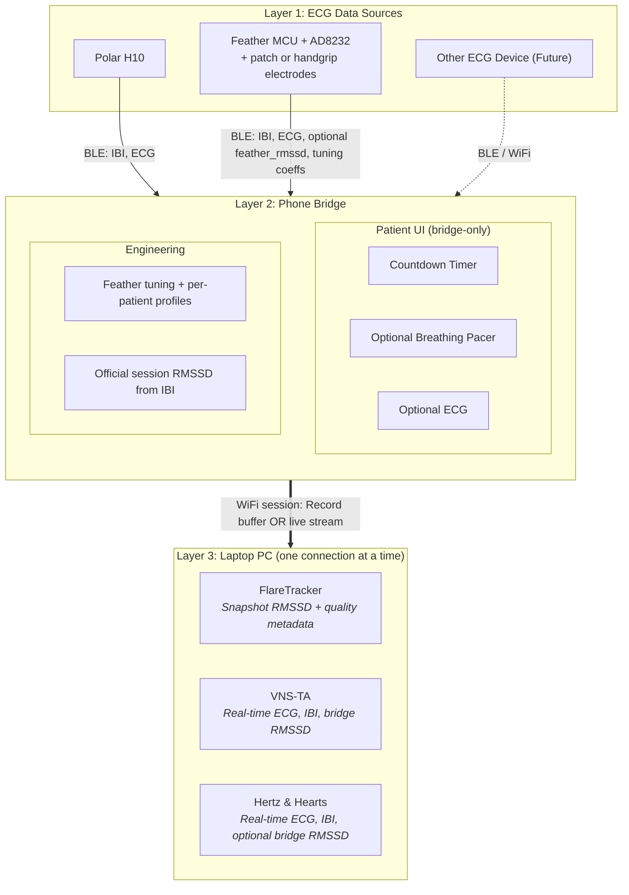

# Phone Bridge System Architecture & Telemetry Specification

**Date:** 2026-09-07  
**Status:** Target architecture (intent) with explicit **now / next / later** vs shipping code  
**Scope:** BLE ingestion → Phone Bridge (edge) → Wi‑Fi session transport → laptop consumers

---

## 1. Purpose

ECG-Phone-Bridge is the shared Android edge for:

- [FlareTracker](https://github.com/JoelAtHome/FlareTracker)
- [VNS-TA](https://github.com/JoelAtHome/VNS-TA)
- [Hertz & Hearts](https://github.com/JoelAtHome/HertzAndHearts)

ECG sources (Polar H10, or Feather — see below) provide beat timing and optional ECG. The phone owns patient-facing session UI, the **official session RMSSD** (computed on the phone from beat intervals), and Wi‑Fi delivery to one PC connection at a time.

**Naming — “Feather”:** The custom path is **Feather MCU + SparkFun AD8232 + patch electrodes or handgrip electrodes**. Elsewhere in this doc, **Feather** means that whole front-end.

**Naming — “ritual” vs “session”:**

| Term | Meaning |
|------|---------|
| **Ritual** | Brief morning (or similar) capture, typically for FlareTracker or some Hertz & Hearts workflows |
| **Session** | Any bridge run, including longer VNS-TA or HnH work — not everything is a “ritual” |

Wi‑Fi carries **session** data (record or stream). Ritual is a *kind* of session, not the name of the transport.

---

## 2. System topology

The diagram below is **[Mermaid](https://mermaid.js.org/)** markup (a Markdown diagram language). On GitHub and many Markdown previews it renders as a flowchart. The first line `flowchart TD` means “flowchart, top-down.” It is not executable code.



**Hard rules**

| Rule | Decision |
|------|----------|
| Dual source | **Either Polar or Feather** — never both in one session |
| PC clients | **One phone bridge-to-PC connection at a time**; multiple users at different times |
| Patient UI | **Bridge-only** (countdown, optional pacer, optional ECG). Remove pacer from VNS-TA; HnH may keep its own pacer for different workflows |
| Peak / beat detection | **On Polar or Feather only** — phone does not primary-detect peaks from ECG |
| Official session RMSSD | **Always computed on the phone bridge from IBI** (the value FlareTracker and other apps should trust) |

---

## 3. Now / next / later

### Now (shipping PolarH10Bridge)

- Polar H10 via Polar BLE SDK: HR/IBI + ECG stream
- UDP discovery (`HnH_PHONE_BRIDGE_DISCOVER_V1`, port **45124**) + TCP NDJSON (default port **8765**)
- Wire types in use: `rr`, `ecg`, `status`; inbound `client_info`
- Ops UI: scan/connect, Wi‑Fi/port, flow diagram, foreground keepalive
- HnH-oriented discovery branding (multi-app contract still evolving)

### Next (shared session bridge)

- Phone UI mode select: **Record session** vs **Stream**
- Bridge official RMSSD from IBI + quality-aware snapshot selection
- Feather BLE path + **per-patient calibration profiles** (phone-local; see §7)
- Versioned multi-app discovery/identity (beyond pure HnH prefix)
- FlareTracker snapshot ingest of bridge RMSSD + metadata

### Later

- Assisted / semi-auto Feather tune with human Accept
- Optional continuous auto-tune (never silent-overwrite last-known-good)
- Share / sync patient calibration profiles across phones (export/import or host-backed)
- Additional ECG peripherals
- Optional HTTP/WebSocket transport if TCP NDJSON proves insufficient

---

## 4. Division of labor: peaks vs RMSSD

**Accurate IBI is the hard problem** (peak detection + noise/morphology rejection).  
**RMSSD from a clean IBI series is easy** (successive differences → RMS).

| Stage | Owner | Notes |
|-------|--------|------|
| Peak / beat detection → IBI | Polar firmware **or** Feather detector | Phone does not re-detect from ECG as product path |
| Official session RMSSD | Phone bridge | Same algorithm for Polar and Feather sessions |
| Optional `feather_rmssd` | Feather | Diagnostics / tune validation only — **not** the FlareTracker value of record |
| Optional PC Python RMSSD | HnH / VNS-TA | Research / cross-check only — not FlareTracker path |

**Confidence in Feather IBI:** reasonable when ECG is fairly clean **and** detector coeffs match that patient/lead (Polar cross-check when available). Untuned coeffs on a different morphology (e.g. RBBB, long QRS, large S) can look “steady” and still be wrong.

**HnH import note:** HnH can compute RMSSD from imported **IBI/RR lists**; it does **not** derive RMSSD from raw imported ECG samples alone.

---

## 5. Telemetry contracts (target)

### 5.1 Polar → bridge (BLE)

- IBI / RR (ms)
- ECG samples (~130 Hz; millivolts on current bridge framing)

### 5.2 Feather → bridge (BLE, target)

```typescript
interface FeatherTelemetryPacket {
  timestamp_ms: number;
  ibi_ms: number[];           // primary beat timing
  ecg_raw?: number[];         // ADC or calibrated µV
  feather_rmssd?: number;     // optional debug twin
  tuning_coeffs?: {
    qrs_threshold: number;
    gain: number;
    filter_alpha: number;
    // extend as firmware exposes
  };
}
```

Exact GATT UUIDs/characteristic layout: TBD with Feather firmware; treat above as semantic contract.

### 5.3 Bridge → laptop (Wi‑Fi session)

**Mode A — Record** (typical **rituals** for FlareTracker / some HnH): buffer during the capture; upload/sync session package when complete.  
**Mode B — Stream** (typical longer **sessions** for HnH / VNS-TA): low-latency NDJSON (or successor) while connected.

Phone UI chooses A vs B.

```typescript
type SourceDevice = "POLAR_H10" | "FEATHER" | "OTHER";
type RmssdSource = "bridge"; // official value always bridge-from-IBI

interface SessionPayload {
  session_id: string;
  start_time_iso: string;
  source_device: SourceDevice;
  mode: "record" | "stream";
  kind?: "ritual" | "session"; // ritual = brief morning-style; optional tag
  sampling_rate_hz?: number;
  data: {
    ibi_series: number[];           // ms
    ecg_samples?: number[];
    rmssd_ms?: number;              // official snapshot when applicable
    rmssd_source: RmssdSource;
    rmssd_window?: {
      settle_trim_s: number;
      analysis_start_s: number;
      analysis_end_s: number;
      method: string;               // e.g. "median_rolling_quality"
    };
    feather_rmssd?: number;         // optional debug
    quality?: {
      skipped_beat_pct?: number;
      flags?: string[];             // e.g. "end_divergence", "no_stable_window"
    };
  };
}
```

**Shipping stream framing (now)** remains TCP newline JSON, e.g.:

- `{"type":"rr","rr_ms":...}`
- `{"type":"ecg","sample_rate_hz":130,"samples_mv":[...]}`
- `{"type":"status",...}`

Evolve with versioned types for `rmssd` snapshots and session control; do not break HnH clients without a protocol version bump.

---

## 6. Official session RMSSD policy (bridge)

### 6.1 Inputs

- IBI stream from either Polar or Feather (accepted beats after source-side rejection when available).

### 6.2 Timing (defaults — all configurable later)

Inspired by HnH phases, adapted for short kid rituals and FlareTracker snapshots:

| Parameter | Default intent | Notes |
|-----------|----------------|-------|
| Sensor / settle trim | **30–45 s** (configurable up to **120 s**) | HnH chart settle default is 15 s; longer settle allowed when the capture is long enough |
| Analysis window | **~60–120 s** or **~60 beats** of clean IBI after settle | Aligns with short-term HRV practice / HnH live ~60-beat window |
| Final trim | Drop last **~15–20 s** when session long enough | Avoids end-regime artifacts (seen on some captures) |

HnH live chart lock uses `SETTLING_DURATION` (default 15 s) + `BASELINE_DURATION` (default 30 s) and a rolling `RMSSD_WINDOW` of 60 beats — useful reference, not identical to FlareTracker snapshot policy.

### 6.3 Window selection (quality-aware)

Do **not** hard-code “always end of session” or “always mid clock time.”

1. After settle, compute rolling RMSSD over the analysis window length.  
2. Prefer a **stable plateau** (median of acceptable rolling estimates), optionally excluding a final trim.  
3. **Do not reject solely because RMSSD is low** (e.g. &lt; 20 ms). Polar-confirmed sessions have shown **~12–17 ms** as real for some morphologies.  
4. Reject / flag on **instability or detector failure** (high skip rate, HR jumps, no stable window, extreme mid↔end divergence without a plateau).  
5. Persist `rmssd_ms`, window bounds, method, and quality flags with every FlareTracker snapshot.

### 6.4 Evidence notes (tuning data)

- **Payton** (no Polar; sensory aversion to strap): mid-session plateau preferred over sudden late collapse to ~17 ms — supports avoiding naive end-of-log quotes when unvalidated.  
- **RBBB / long-QRS subject** (Aug 31 H-frame logs, tuning progressed by file number): later low RMSSD (~12–17) **agreed with simultaneous HnH+Polar** — low values can be correct after proper tune; earlier higher values reflected pre-tune detector error.

---

## 7. Feather calibration & patient profiles

Feather does **not** currently self-tune across patients with very different ECGs. Retune was required when switching subjects.

**V1 (required)**

- Per-patient **calibration profile** (patient name → detector coeffs).  
- **Stored on the phone that performed the calibration** (local to that device).  
- Pushed to Feather at session start.  
- Engineering UI: inspect signal, adjust, save, recheck anytime.  
- When Polar available: use as referee during calibrate; record agreement metadata on the profile.

**V1.5**

- Guided / assisted tune (short still capture → suggested coeffs → human Accept).

**Later**

- Optional continuous auto-tune with last-known-good rollback — never silent sole authority.  
- **Share profiles across phones** (export/import file, or sync via a host app) so a second phone can reuse the same patient’s tune without redoing calibration from scratch.

---

## 8. Host consumers

| App | Typical bridge mode | Primary payloads |
|-----|---------------------|------------------|
| FlareTracker | Record → snapshot (often a **ritual**) | Official **bridge** RMSSD + window/quality metadata only — no RMSSD math in FlareTracker |
| VNS-TA | Stream (often a longer **session**) | Real-time ECG, IBI; bridge RMSSD as available. Bridge owns optional patient pacer (remove from VNS-TA) |
| Hertz & Hearts | Stream or Record | Real-time ECG, IBI; may keep its own pacer; PC RMSSD optional cross-check |

---

## 9. Protocol / ops constraints

- Treat discovery + framing as a **versioned contract** when adding FlareTracker / VNS-TA (today still HnH-branded).  
- One phone bridge-to-PC connection at a time; different users at different times.  
- Foreground service keepalive remains part of reliable bridging on Android.  
- Dev environment notes (AGP/Gradle/Wi‑Fi) live in `PASSDOWN.md` — not product architecture.

---

## 10. Open items (small)

1. Exact Feather GATT layout and coeff field set.  
2. Final numeric defaults for settle / analysis / final-trim after more kid rituals.  
3. Formal protocol version string and discovery rename timeline.  
4. Record-mode artifact format (CSV / EDF / JSON package) for host import.  
5. Cross-phone calibration profile share format (when “Later” lands).

---

## 11. Related repo docs

- `README.md` — layout, releases, protocol caution  
- `PASSDOWN.md` — Android Studio / network tooling passdown  
- `CHANGELOG.md` — bridge release notes  
- FlareTracker H-frame tuning notes under `hardware/h-frame-hrv-esp32/Tuning Data/`  
- HnH: `SETTLING_DURATION` / `BASELINE_DURATION` / `RMSSD_WINDOW` in config; import computes RMSSD from IBIs only (`hnh/import_session.py`)
