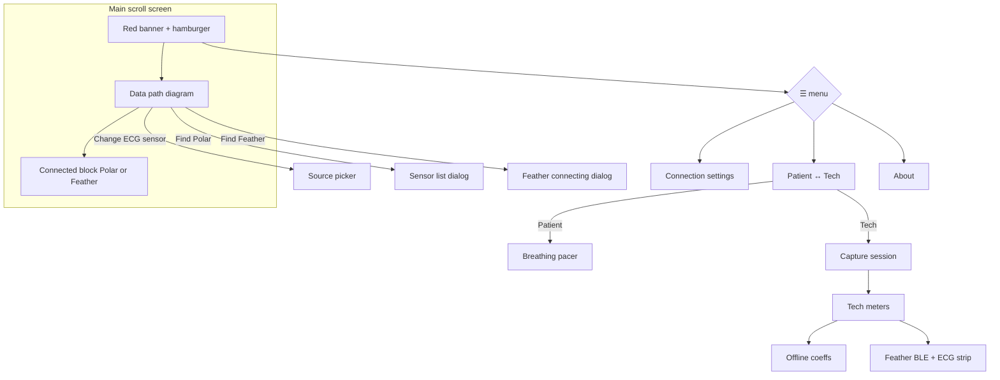

# ECG Phone Bridge — UI layout map (β.45)

Printable wireframes of **what ships today**. Mark up freely; this is not a redesign proposal.

**Views:** one main scroll screen. Menu toggles **Patient** ↔ **Tech**. Overlays are dialogs.

---

## 1. Screen stack (top → bottom)

```
┌─────────────────────────────────────────┐
│  RED BANNER                             │
│  "ECG Phone Bridge"              [☰]    │
│                         ┌─────────────┐ │
│                         │ Conn settings│ │
│                         │ Patient/Tech │ │
│                         │ About        │ │
│                         └─────────────┘ │
├─────────────────────────────────────────┤
│  [opt] Update banner: Get update | Later│
├─────────────────────────────────────────┤
│  [opt] Wi‑Fi client off (hotspot note)  │
├─────────────────────────────────────────┤
│                                         │
│           ▼ SCROLL BODY ▼               │
│                                         │
│  [opt] "On your PC… IP:port"            │
│  [opt] Background keep-alive note       │
│                                         │
│  ┌─ DATA PATH (BridgeFlowDiagram) ────┐ │
│  │         [ heart glyph ]            │ │
│  │              │                     │ │
│  │   [ TAP TO FIND / Polar or Feather]│ │  ← remembered kind
│  │     "Polar H10: Bluetooth"         │ │
│  │     [opt in-progress line]         │ │
│  │     [ Change ECG sensor ]          │ │
│  │              │                     │ │
│  │         [ this phone ]             │ │
│  │              │                     │ │
│  │         [ PC / host ]              │ │  ← user + client_app
│  └────────────────────────────────────┘ │
│                                         │
│  [if Polar or Feather BLE linked]       │
│    Connected to: name · contact · …     │
│    [ Disconnect sensor ]                │
│    Phone IP / hotspot line              │
│                                         │
│  ╔═══════════════════════════════════╗  │
│  ║  TECH VIEW ONLY                   ║  │
│  ║  · Capture session panel          ║  │
│  ║  · Tech meters (+ profile/BLE)    ║  │
│  ║  · (no breathing pacer in docs;   ║  │
│  ║     pacer also composes in Tech)  ║  │
│  ╚═══════════════════════════════════╝  │
│                                         │
│  ╔═══════════════════════════════════╗  │
│  ║  PATIENT VIEW ONLY                ║  │
│  ║  · Breathing pacer                ║  │
│  ║  · (no Capture / Tech meters)     ║  │
│  ╚═══════════════════════════════════╝  │
│                                         │
├─────────────────────────────────────────┤
│  Footer: version · "J. Kobe Software"   │
└─────────────────────────────────────────┘
```

---

## 2. Patient view (scroll body detail)

```
┌─────────────────────────────────────────┐
│  [hints + Data path diagram]            │
│  [Change ECG sensor] [Find…]            │
│  [optional connected block]             │
│                                         │
│  ┌─ BREATHING PACER ──────────────────┐ │
│  │  title / short help                │ │
│  │  presets:  5.5/5.5  5/5  4/6  4/4  │ │
│  │                                    │ │
│  │         ( expanding circle )       │ │
│  │           Inhale / Exhale          │ │
│  │              [n]                   │ │
│  │                                    │ │
│  │         [ Start / Stop pacer ]     │ │
│  └────────────────────────────────────┘ │
└─────────────────────────────────────────┘
```

**Patient can:** Change ECG sensor (Polar / Feather), Find / Disconnect, pace breath, open menu (settings / Tech / About).  
**Patient cannot:** Start/Stop capture, Feather sim, edit coeffs, see Tech meters / ECG strip.

---

## 3. Tech view (scroll body detail)

```
┌─────────────────────────────────────────┐
│  [hints + Data path diagram]            │
│  [optional connected block]             │
│                                         │
│  ┌─ CAPTURE SESSION ──────────────────┐ │
│  │  Stream ○     Record ○             │ │
│  │  Idle|Running · kind · session_id  │ │
│  │  IBIs · RMSSD                      │ │
│  │  [hint if no source]               │ │
│  │  [ Start ]          [ Stop ]       │ │
│  └────────────────────────────────────┘ │
│                                         │
│  ┌─ TECH METERS ──────────────────────┐ │
│  │  Mode / Settling / Elapsed         │ │
│  │  Contact · IBIs · bpm · dBm        │ │
│  │  Bridge RMSSD · Accepted beats     │ │
│  │  Quality flags  [i]  + chips       │ │
│  │                                    │ │
│  │  [ Simulate Feather IBI + ECG ]    │ │
│  │                                    │ │
│  │  ── Offline coeffs ──              │ │
│  │  Active: name (id)                 │ │
│  │  [Change] [Add patient] [Delete]   │ │
│  │  coeff fields (editable keys)      │ │
│  │  [ Save profile / Save+push ] *    │ │
│  │                                    │ │
│  │  ── Feather BLE ──                 │ │
│  │  phase — detail · Last IBI         │ │
│  │  "Find Feather on the data path."  │ │
│  │    or [Start][Stop][Disconnect]    │ │
│  │  ECG strip label                   │ │
│  │  ┌─────────────────────────────┐   │ │
│  │  │     live / sim ECG strip    │   │ │
│  │  └─────────────────────────────┘   │ │
│  └────────────────────────────────────┘ │
└─────────────────────────────────────────┘
  * gray until coeffs dirty
```

---

## 4. Overlays (dialogs)

```
☰ menu
  ├─ Connection settings ──► Dialog
  │     Bridge port [____] [Select ▾]
  │     IP · subnet (read-only)
  │     Keep bridge active in background [switch]
  │     [Cancel]  [Save]*
  │       └─ confirm: Change port? / Disconnect PC?
  │
  ├─ Switch Patient ↔ Tech
  └─ About ──► Dialog (date, version, Close)

Change ECG sensor (under Data path node)
  Polar H10 / Feather radio list
  [Close]

Sensor list (Find when Polar is selected)
  Scanning… / radio list / Connecting…
  [Cancel] [Connect]

Feather connecting (Find when Feather is selected)
  Spinner + "Looking for ECG-Box-Feather…" / "Connecting…" / "Setting up link…"
  Error stays with message + [Close]
  [Cancel] stops BLE; tap outside hides overlay but connect continues

Tech-only nested dialogs
  ├─ Profile picker (Change)
  ├─ Add patient (name → OK)
  ├─ Delete confirm
  └─ Quality flag help [i]
```

---

## 5. View / overlay flow (Mermaid)



---

## 6. Markup scratch (print & scribble)

Known parked / cleanup themes from handoff (not commitments):

| Area | Today | Notes / ideas |
|------|--------|----------------|
| Source CTA | Remembered Polar / Feather node + Change | Future kinds = extra picker rows |
| Capture Start/Stop | Tech only | OK for patient? |
| Breathing pacer | Intended Patient-only; also composes in Tech | |
| Profile + coeffs | Long Tech scroll | Collapse / Tuner-only? |
| ECG strip | Always under Feather BLE | |

---

*Generated from Compose layout as of v1.0.0-beta.46. Update when chrome changes.*
