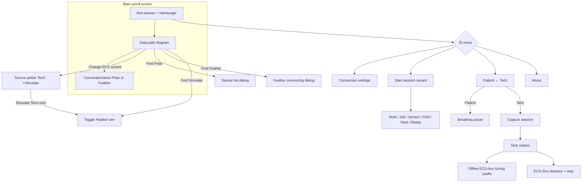
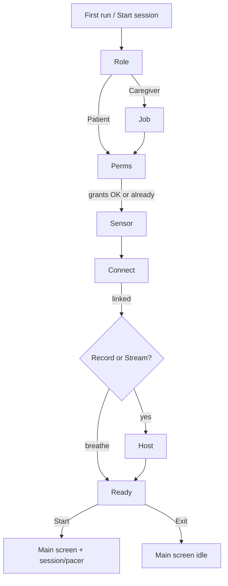

# ECG Phone Bridge — UI layout map (β.45)

Printable wireframes of **what ships today**. Mark up freely; this is not a redesign proposal.

**Views:** one main scroll screen. Menu toggles **Patient** ↔ **Tech**. Overlays are dialogs.

---

## 1. Screen stack (top → bottom)

```
┌─────────────────────────────────────────┐
│  RED BANNER                             │
│  "ECG Phone Bridge"              [☰]    │
│                         ┌─────────────┐ │
│                         │ Conn settings│ │
│                         │ Patient/Tech │ │
│                         │ About        │ │
│                         └─────────────┘ │
├─────────────────────────────────────────┤
│  [opt] Update banner: Get update | Later│
├─────────────────────────────────────────┤
│  [opt] Wi‑Fi client off (hotspot note)  │
├─────────────────────────────────────────┤
│                                         │
│           ▼ SCROLL BODY ▼               │
│                                         │
│  [opt] "On your PC… IP:port"            │
│  [opt] Background keep-alive note       │
│                                         │
│  ┌─ DATA PATH (BridgeFlowDiagram) ────┐ │
│  │         [ heart glyph ]            │ │
│  │              │                     │ │
│  │   [ TAP TO FIND / Polar·Feather·Sim]│ │  ← remembered kind (Sim = Tech)
│  │     "Polar H10: Bluetooth"         │ │
│  │     [opt in-progress line]         │ │
│  │     [ Change ECG sensor ]          │ │
│  │              │                     │ │
│  │         [ this phone ]             │ │
│  │              │                     │ │
│  │         [ PC / host ]              │ │  ← user + client_app
│  └────────────────────────────────────┘ │
│                                         │
│  [if Polar or Feather BLE linked]       │
│    Connected to: name · contact · …     │
│    (Disconnect via sensor pill modal)   │
│                                         │
│  ╔═══════════════════════════════════╗  │
│  ║  TECH VIEW ONLY                   ║  │
│  ║  · Capture session panel          ║  │
│  ║  · Tech meters (+ profile/BLE)    ║  │
│  ║  · (no breathing pacer)           ║  │
│  ╚═══════════════════════════════════╝  │
│                                         │
│  ╔═══════════════════════════════════╗  │
│  ║  PATIENT VIEW ONLY                ║  │
│  ║  · Breathing pacer                ║  │
│  ║  · (no Capture / Tech meters)     ║  │
│  ╚═══════════════════════════════════╝  │
│                                         │
├─────────────────────────────────────────┤
│  Footer: version · "J. Kobe Software"   │
└─────────────────────────────────────────┘
```

---

## 2. Patient view (scroll body detail)

```
┌─────────────────────────────────────────┐
│  [hints + Data path diagram]            │
│  [Change ECG sensor] [Find…]            │
│  [optional connected block]             │
│                                         │
│  ┌─ BREATHING PACER ──────────────────┐ │
│  │  title / short help                │ │
│  │  presets:  5.5/5.5  5/5  4/6  4/4  │ │
│  │                                    │ │
│  │         ( expanding circle )       │ │
│  │           Inhale / Exhale          │ │
│  │              [n]                   │ │
│  │                                    │ │
│  │         [ Start / Stop pacer ]     │ │
│  └────────────────────────────────────┘ │
└─────────────────────────────────────────┘
```

**Patient can:** Change ECG sensor (Polar / Feather only), Find / Disconnect, pace breath, open menu (settings / Tech / About).  
**Patient cannot:** Start/Stop capture, Simulate, edit coeffs, see Tech meters / ECG strip.

---

## 3. Tech view (scroll body detail)

```
┌─────────────────────────────────────────┐
│  [hints + Data path diagram]            │
│  [optional connected block]             │
│                                         │
│  ┌─ CAPTURE SESSION ──────────────────┐ │
│  │  Stream ○     Record ○             │ │
│  │  blurb: Stream=VNS-TA / Record=FT  │ │
│  │         HnH: either                │ │
│  │  Idle|Running · kind · session_id  │ │
│  │  IBIs · RMSSD                      │ │
│  │  [hint if no source]               │ │
│  │  [ Start ]          [ Stop ]       │ │
│  └────────────────────────────────────┘ │
│                                         │
│  ┌─ TECH METERS ──────────────────────┐ │
│  │  Mode / Settling / Elapsed         │ │
│  │  Contact · IBIs · bpm · dBm        │ │
│  │  Bridge RMSSD · Accepted beats     │ │
│  │  Quality flags  [i]  + chips       │ │
│  │                                    │ │
│  │  ── Offline ECG-box tuning coeffs ─│ │
│  │  (collapsed by default)            │ │
│  │                                    │ │
│  │  ── ECG-Box detector ──            │ │
│  │  human phase · Last IBI            │ │
│  │  ECG strip                         │ │
│  │  ┌─────────────────────────────┐   │ │
│  │  │     live / sim ECG strip    │   │ │
│  │  └─────────────────────────────┘   │ │
│  └────────────────────────────────────┘ │
└─────────────────────────────────────────┘
  * gray until coeffs dirty
  * Simulate is Tech-only via Change ECG sensor (not a meters link)
```

---

## 4. Overlays (dialogs)

```
☰ menu
  ├─ Connection settings ──► Dialog
  │     Bridge port [____] [Select ▾]
  │     IP · subnet (read-only)
  │     Keep bridge active in background [switch]
  │     [Cancel]  [Save]*
  │       └─ confirm: Change port? / Disconnect PC?
  │
  ├─ Start session ──► Startup Wizard overlay (session coach)
  ├─ Switch Patient ↔ Tech
  ├─ Check for updates ──► force GitHub check (banner + toast)
  └─ About ──► Dialog (date, version, Close)

Change ECG sensor (under Data path node)
  Patient: Polar H10 / Feather
  Tech: Polar H10 / Feather / Simulate
  [Close]
  Simulate blocked (live Polar / ECG-Box) → disconnect-first dialog
  Connected pill colors: Polar teal · Feather green · Simulate amber (+pulse)

Connected sensor pill → ECG sensor
  [Disconnect]
  [Rescan]
  [Cancel]   (stacked, center-aligned)

Sensor list (Find when Polar is selected)
  Scanning… / radio list / Connecting…
  [Cancel] [Connect]

Feather connecting (Find when Feather is selected)
  Spinner + "Looking for ECG-Box-Feather…" / "Connecting…" / "Setting up link…"
  Error stays with message + [Close]
  [Cancel] stops BLE; tap outside hides overlay but connect continues

Tech-only nested dialogs
  ├─ Profile picker (Change)
  ├─ Add patient (name → OK)
  ├─ Delete confirm
  ├─ PC patient hint → Keep/Switch (Feather/Simulate override)
  ├─ Quality flag help [i]
  └─ Simulate Feather blocked (live Polar / ECG-Box connected → OK)
```

---

## 5. View / overlay flow (Mermaid)



---

## 6. Markup scratch (print & scribble)

Known parked / cleanup themes from handoff (not commitments):

| Area | Today | Notes / ideas |
|------|--------|----------------|
| Source CTA | Polar / Feather / Simulate (Tech) + Change | Connected pill: Polar teal, Feather green, Sim amber+pulse |
| Capture Start/Stop | Tech only | OK for patient? |
| Breathing pacer | Patient only | |
| Profile + coeffs | Collapsed Offline section | |
| ECG strip | Under ECG-Box detector | |
| First-run | **Startup Wizard** MVP | Full-screen session coach; menu **Start session** |
| Phone-alone ritual | Persist + delayed push (PROTOCOL §7) | Hosts: `ritual_ack` + dedupe |

---

## 7. Startup Wizard (session coach) — design + ship sketch

**Goal:** Occasional users reach a ready state without hunting Tech/Patient, Stream/Record, or the data-path Find control. Power users skip via **Exit to main screen**.

**Shape:** Full-screen overlay (not coach-marks on the dense scroll). Reuses existing Find / BLE dialogs / session Start. No Simulate, coeffs, strip, or port settings in the wizard.

**Entry**
- **Every cold start** (Activity create) opens the wizard — session coach, not one-shot onboarding. Exit dismisses until process death or ☰ **Start session**.
- ☰ → **Start session** (always; resets step flow, keeps last role/job prefs)

**Jobs**

| Role | Jobs offered | Side effects on finish |
|------|----------------|------------------------|
| Caregiver | Record HRV · Stream (no Just breathe) | Tech view; mode Record or Stream |
| Patient | Just breathe (skips sensor / PC / permissions) | Patient view; no capture Start |

**Breathe** (Patient only): Role → Ready → finish tip — **no** sensor or PC steps.

**Sensor picker (caregiver capture):** Polar · Feather · **Simulate** (troubleshooting; Find starts synthetic IBI+ECG).

**PC Wait copy (job-specific)**
- Record HRV → FlareTracker Companion, Hertz & Hearts, or ECG-Box Tuner
- Stream → VNS-TA, Hertz & Hearts, or ECG-Box Tuner

### Step wireframes

```
┌─ ROLE ──────────────────────────────────┐
│  Who is using this phone?               │
│  ○ Caregiver   ○ Patient                │
│                    [Continue]  [Exit]   │
└─────────────────────────────────────────┘

┌─ JOB (caregiver) ───────────────────────┐
│  What do you want to do?                │
│  ○ Record HRV (FlareTracker)            │
│  ○ Stream (VNS-TA / live)               │
│                    [Back] [Continue]    │
└─────────────────────────────────────────┘

┌─ PERMISSIONS (only if missing) ─────────┐
│  Bluetooth / nearby devices needed      │
│  to find your ECG sensor.               │
│              [Allow] → system prompt    │
│                    [Back] [Continue]*   │
└─────────────────────────────────────────┘
  * Continue enabled when grants OK

┌─ SENSOR ────────────────────────────────┐
│  Which ECG sensor?                      │
│  ○ Polar H10   ○ Feather   ○ Simulate   │
│  [opt already-connected hints]          │
│                    [Back] [Continue]    │
└─────────────────────────────────────────┘

┌─ CONNECT ───────────────────────────────┐
│  Put the strap/box on. Tap Find.        │
│           [ Find sensor ]               │
│  status: Waiting… / Connected: name     │
│                    [Back] [Continue]*   │
└─────────────────────────────────────────┘
  * Continue when Polar/Feather linked (reuse Find dialogs)

┌─ HOST (Record / Stream; skip breathe) ──┐
│  Connect a PC app on this Wi‑Fi?        │
│  ○ Wait for PC   ○ Phone alone for now  │
│  (shows IP:port hint when waiting)      │
│                    [Back] [Continue]*   │
└─────────────────────────────────────────┘
  * Wait path: Continue when pcBridgeConnected
    Phone-alone: Continue immediately (Record can Send HRV later)

┌─ READY ─────────────────────────────────┐
│  Summary: Caregiver · Record HRV ·      │
│           Polar · PC linked | alone     │
│     [ Start recording ]  or             │
│     [ Start stream ]     or             │
│     [ Go to breathing pacer ]           │
│                    [Back] [Exit]        │
└─────────────────────────────────────────┘
```

### Flow (Mermaid)



### Prefs / state (Compose sketch)

| Pref / field | Purpose |
|--------------|---------|
| `bridge_wizard_completed` | Suppress auto-open after first successful finish or Exit |
| `bridge_wizard_last_role` | `caregiver` / `patient` |
| `bridge_wizard_last_job` | `record` / `stream` / `breathe` |
| Local step enum | `Role → Job → Permissions → Sensor → Connect → Host → Ready` |

Wizard reads live `BridgeScreenState` for sensor link, PC link, and Wi‑Fi IP hint. Writes via existing Activity hooks: `setTechView`, `setSelectedSourceKind`, `setPreferredSessionMode`, `beginFindSource`, `startBridgeSession`.

**Out of v1:** Simulate, profile/coeffs, quality chips, stuck-checker deep links, post-Stop Send HRV nudge (later).

**Code:** `StartupWizard.kt` + menu / first-run wiring in `MainActivity`.

---

*Generated from Compose layout as of v1.0.0-beta.52; §7 wizard sketch added for β.54 work. Update when chrome changes.*
